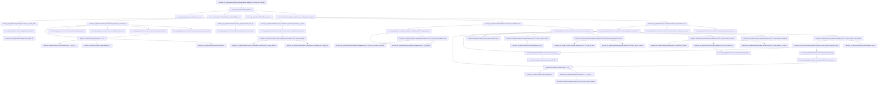

```mermaid
flowchart TB
    n1["transcript_etl_pipeline.cli:cli.py:225:main"]
    n2["transcript_etl_pipeline.cli:cli.py:28:create_parser"]
    n3["transcript_etl_pipeline.cli:cli.py:73:generate_default_filename"]
    n4["transcript_etl_pipeline.cli:cli.py:86:run_pipeline"]
    n5["transcript_etl_pipeline.config:config.py:12:get_config_dir"]
    n6["transcript_etl_pipeline.config:config.py:25:get_config_file"]
    n7["transcript_etl_pipeline.config:config.py:55:save_last_output_folder"]
    n8["transcript_etl_pipeline.devtools.debug_callgraph:debug_callgraph.py:143:run_with_callgraph"]
    n9["transcript_etl_pipeline.document.model:<string>:2:__init__"]
    n10["transcript_etl_pipeline.document.model:model.py:32:__post_init__"]
    n11["transcript_etl_pipeline.document.model:model.py:67:<lambda>"]
    n12["transcript_etl_pipeline.document.model:model.py:69:add_paragraph"]
    n13["transcript_etl_pipeline.document.model:model.py:83:<lambda>"]
    n14["transcript_etl_pipeline.document.model:model.py:87:add_section"]
    n15["transcript_etl_pipeline.document.parser:parser.py:105:_extract_label"]
    n16["transcript_etl_pipeline.document.parser:parser.py:141:_is_metadata_label"]
    n17["transcript_etl_pipeline.document.parser:parser.py:16:parse_enhanced_text"]
    n18["transcript_etl_pipeline.extract.from_file:from_file.py:12:detect_encoding"]
    n19["transcript_etl_pipeline.extract.from_file:from_file.py:35:extract_from_file"]
    n20["transcript_etl_pipeline.formatters.docx_formatter:docx_formatter.py:101:_apply_spacing"]
    n21["transcript_etl_pipeline.formatters.docx_formatter:docx_formatter.py:124:_apply_font"]
    n22["transcript_etl_pipeline.formatters.docx_formatter:docx_formatter.py:39:format_to_docx"]
    n23["transcript_etl_pipeline.formatters.docx_formatter:docx_formatter.py:64:_format_section"]
    n24["transcript_etl_pipeline.formatters.docx_formatter:docx_formatter.py:75:_format_paragraph"]
    n25["transcript_etl_pipeline.logging_config:logging_config.py:8:setup_logging"]
    n26["transcript_etl_pipeline.transform.enhance:enhance.py:10:enhance_text"]
    n27["transcript_etl_pipeline.transform.name:<string>:2:__init__"]
    n28["transcript_etl_pipeline.transform.name:name.py:102:shortened_variants"]
    n29["transcript_etl_pipeline.transform.name:name.py:173:__hash__"]
    n30["transcript_etl_pipeline.transform.name:name.py:182:<genexpr>"]
    n31["transcript_etl_pipeline.transform.name:name.py:187:from_string"]
    n32["transcript_etl_pipeline.transform.name:name.py:221:_name_resolution"]
    n33["transcript_etl_pipeline.transform.name:name.py:28:<lambda>"]
    n34["transcript_etl_pipeline.transform.name:name.py:65:_build_reverse_mapping"]
    n35["transcript_etl_pipeline.transform.name:name.py:77:__post_init__"]
    n36["transcript_etl_pipeline.transform.name:name.py:85:full_name"]
    n37["transcript_etl_pipeline.transform.normalize:normalize.py:108:_normalize_labels"]
    n38["transcript_etl_pipeline.transform.normalize:normalize.py:138:normalize_text"]
    n39["transcript_etl_pipeline.transform.normalize:normalize.py:23:_normalize_line_endings"]
    n40["transcript_etl_pipeline.transform.normalize:normalize.py:39:_clean_whitespace"]
    n41["transcript_etl_pipeline.transform.paragraphs:paragraphs.py:117:_ends_with_sentence_terminator"]
    n42["transcript_etl_pipeline.transform.paragraphs:paragraphs.py:17:detect_paragraphs"]
    n43["transcript_etl_pipeline.transform.paragraphs:paragraphs.py:69:_is_label_line"]
    n44["transcript_etl_pipeline.transform.paragraphs:paragraphs.py:83:_should_add_paragraph_break"]
    n45["transcript_etl_pipeline.transform.speakers:speakers.py:187:_extract_speaker_labels"]
    n46["transcript_etl_pipeline.transform.speakers:speakers.py:204:<genexpr>"]
    n47["transcript_etl_pipeline.transform.speakers:speakers.py:2127:_ensure_nltk_data"]
    n48["transcript_etl_pipeline.transform.speakers:speakers.py:2180:strip_before_transcript"]
    n49["transcript_etl_pipeline.transform.speakers:speakers.py:2192:extract_person_names_from_text"]
    n50["transcript_etl_pipeline.transform.speakers:speakers.py:228:_identify_speaker_by_name"]
    n51["transcript_etl_pipeline.transform.speakers:speakers.py:2375:_apply_speaker_mappings"]
    n52["transcript_etl_pipeline.transform.speakers:speakers.py:2403:_is_speaker_line"]
    n53["transcript_etl_pipeline.transform.speakers:speakers.py:2420:<genexpr>"]
    n54["transcript_etl_pipeline.transform.speakers:speakers.py:2439:_extract_names_from_line"]
    n55["transcript_etl_pipeline.transform.speakers:speakers.py:498:_is_direct_address_to_person"]
    n56["transcript_etl_pipeline.transform.speakers:speakers.py:574:_extract_names_from_metadata"]
    n57["transcript_etl_pipeline.transform.speakers:speakers.py:597:<genexpr>"]
    n58["transcript_etl_pipeline.transform.speakers:speakers.py:71:resolve_speakers"]
    n1 --> n2
    n1 --> n3
    n1 --> n4
    n1 --> n25
    n4 --> n7
    n4 --> n17
    n4 --> n19
    n4 --> n22
    n4 --> n26
    n4 --> n38
    n6 --> n5
    n7 --> n6
    n8 --> n1
    n9 --> n10
    n9 --> n11
    n9 --> n13
    n15 --> n9
    n17 --> n9
    n17 --> n12
    n17 --> n14
    n17 --> n15
    n17 --> n16
    n19 --> n18
    n22 --> n23
    n23 --> n24
    n24 --> n20
    n24 --> n21
    n26 --> n42
    n26 --> n58
    n27 --> n33
    n27 --> n35
    n29 --> n30
    n31 --> n32
    n32 --> n27
    n35 --> n34
    n38 --> n37
    n38 --> n39
    n38 --> n40
    n42 --> n43
    n42 --> n44
    n44 --> n41
    n44 --> n43
    n45 --> n46
    n49 --> n47
    n49 --> n48
    n50 --> n28
    n50 --> n52
    n50 --> n55
    n52 --> n53
    n54 --> n29
    n54 --> n31
    n56 --> n54
    n56 --> n57
    n58 --> n27
    n58 --> n29
    n58 --> n36
    n58 --> n45
    n58 --> n49
    n58 --> n50
    n58 --> n51
    n58 --> n56
```
