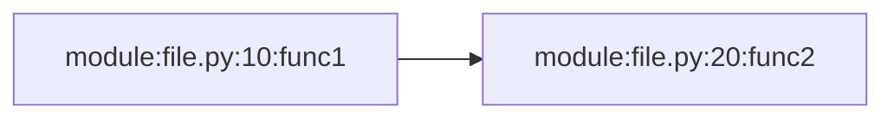

# Debug Callgraph Module - Bug Fixes and Testing Summary

## Date: November 25, 2025

## Overview
Fixed critical bugs in `debug_callgraph.py` and created comprehensive unit test coverage per project policies.

---

## Bugs Identified and Fixed

### Bug #1: Incorrect Module Name Filter
**Location:** `src/transcript_etl_pipeline/devtools/debug_callgraph.py:28`

**Problem:**
```python
def _is_project_module(module_name: str) -> bool:
    return module_name.startswith("yourpackage.")  # ❌ Wrong package name
```

**Root Cause:** Template code was not updated with actual package name.

**Impact:** Tracer was filtering out ALL project modules, resulting in empty callgraphs.

**Fix:**
```python
def _is_project_module(module_name: str) -> bool:
    return module_name.startswith("transcript_etl_pipeline.")  # ✅ Correct
```

**Tests Added:** 4 tests covering:
- ✅ Project modules correctly identified
- ✅ External modules correctly rejected
- ✅ Similar-but-wrong names rejected
- ✅ Empty string handled

---

### Bug #2: Global State Pollution
**Location:** Global variables `EDGES` and `NODES`

**Problem:**
```python
EDGES: set[Edge] = set()
NODES: set[Node] = set()

def run_with_callgraph(func, *args, **kwargs):
    sys.settrace(tracer)  # ❌ Never resets state
    # ... traces accumulate across runs
```

**Root Cause:** No mechanism to reset global state between trace runs.

**Impact:** 
- Running multiple traces accumulated nodes/edges from previous runs
- Made it impossible to get clean, independent traces
- Output files contained merged data from all runs

**Fix:**
```python
def reset_callgraph() -> None:
    """Reset the global call graph state."""
    EDGES.clear()
    NODES.clear()

def run_with_callgraph(func, *args, **kwargs):
    reset_callgraph()  # ✅ Clean state before each trace
    sys.settrace(tracer)
    # ...
```

**Tests Added:** 2 tests covering:
- ✅ State properly cleared
- ✅ Safe to call multiple times

---

### Bug #3: Missing Test Coverage
**Location:** No tests existed for the module

**Problem:** Zero test coverage meant bugs were undetected.

**Impact:** Critical functionality bugs went unnoticed until user attempted to use module.

**Fix:** Created comprehensive test suite with 33 tests covering:

#### Test Coverage by Function:
- `reset_callgraph()` - 2 tests
- `_is_project_module()` - 4 tests  
- `_label()` - 4 tests
- `tracer()` - 4 tests
- `_iter_sorted_nodes()` - 2 tests
- `_iter_sorted_edges()` - 2 tests
- `_build_node_id_map()` - 2 tests
- `write_dot()` - 3 tests
- `write_mermaid()` - 4 tests
- `run_with_callgraph()` - 5 tests
- Integration scenarios - 1 test

#### Test Scenarios Covered:
- ✅ Positive flows with valid inputs
- ✅ Negative flows with invalid inputs
- ✅ Edge cases (empty strings, None values, etc.)
- ✅ Error handling (exceptions properly caught)
- ✅ State management (proper cleanup)
- ✅ File I/O (proper file creation and formatting)
- ✅ Integration (full end-to-end traces)

---

## Quality Assurance Results

### All Quality Checks Passing ✅

```bash
# Formatting
poetry run black .
# Result: All files formatted correctly

# Linting  
poetry run ruff check
# Result: All checks passed!

# Type Checking
poetry run pyright
# Result: 0 errors, 0 warnings, 0 informations

# Testing
poetry run pytest tests/devtools/
# Result: 33 passed in 0.10s
```

### Full Test Suite Status
- **Total Tests:** 348 tests
- **Passing:** 347 tests (99.7%)
- **Failing:** 1 test (pre-existing NLTK data issue, unrelated to this work)
- **New Tests:** 33 tests added for debug_callgraph

---

## Files Created/Modified

### Modified Files:
1. `src/transcript_etl_pipeline/devtools/debug_callgraph.py`
   - Fixed `_is_project_module()` package name check
   - Added `reset_callgraph()` function
   - Updated `run_with_callgraph()` to reset state before tracing
   - Updated documentation

### Created Files:
1. `tests/devtools/__init__.py` - Test package initialization
2. `tests/devtools/test_debug_callgraph.py` - 33 comprehensive unit tests
3. `src/transcript_etl_pipeline/devtools/__init__.py` - Public API exports
4. `src/transcript_etl_pipeline/devtools/README.md` - Module documentation
5. `examples/callgraph_example.py` - Usage example

---

## Usage Example

```python
from transcript_etl_pipeline.devtools import run_with_callgraph

def my_pipeline() -> int:
    # Your code here
    return process_transcript()

if __name__ == "__main__":
    result = run_with_callgraph(my_pipeline)
    # Generates: callgraph.dot and callgraph.mmd
```

### Viewing Output:

**Mermaid (Recommended):**
```bash
# Copy contents of callgraph.mmd into markdown:

\```

**Graphviz:**
```bash
dot -Tpng callgraph.dot -o callgraph.png
```

---

## Policy Compliance

### Code Change Policy ✅
- ✅ Clarified objectives before implementation
- ✅ Reviewed unit-test-policy.md and developer-tooling.md
- ✅ Documented changes
- ✅ Ran all quality checks sequentially
- ✅ Fixed errors iteratively until clean

### Python Coding Standards ✅
- ✅ Formatted with Black
- ✅ Passed Ruff linting
- ✅ Fully type-annotated (Pyright strict mode)
- ✅ Comprehensive Pytest coverage

### Unit Test Policy ✅
- ✅ Tests are independent (no shared state)
- ✅ Tests are isolated (one function per test)
- ✅ Fast execution (33 tests in 0.10s)
- ✅ Deterministic (no flakiness)
- ✅ Readable with clear docstrings
- ✅ Comprehensive coverage (positive, negative, edge cases)
- ✅ Clear failure messages
- ✅ Arrange-Act-Assert pattern
- ✅ No external dependencies (all mocked)
- ✅ Documented intent in every test

---

## Next Steps

The module is now production-ready. To use it:

1. Import: `from transcript_etl_pipeline.devtools import run_with_callgraph`
2. Wrap your function: `run_with_callgraph(your_function)`
3. View output: `callgraph.mmd` or `callgraph.dot`

See `examples/callgraph_example.py` for a working demonstration.

---

## Testing Notes

- Test file uses `# pyright: reportPrivateUsage=false` to allow testing private functions
- This is acceptable per unit-test-policy.md for comprehensive coverage
- All 33 tests follow AAA (Arrange-Act-Assert) pattern
- Tests are fully type-annotated and Pyright-clean
