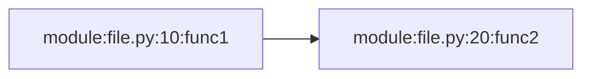

# Debug Callgraph Module

## Overview

The `debug_callgraph` module provides Python function call tracing with output in both Graphviz DOT and Mermaid flowchart formats. It's useful for visualizing execution flows and understanding how functions call each other.

## Bugs Fixed

### 1. **Incorrect Module Name Check**
- **Issue**: Module was hardcoded to check for `"yourpackage."` instead of `"transcript_etl_pipeline."`
- **Fix**: Updated `_is_project_module()` to check for the correct package name
- **Impact**: The tracer will now correctly capture calls within the transcript ETL pipeline

### 2. **Global State Pollution**
- **Issue**: `EDGES` and `NODES` sets were never reset between runs, causing accumulated data across multiple traces
- **Fix**: Added `reset_callgraph()` function and called it in `run_with_callgraph()` before starting a new trace
- **Impact**: Each trace now starts with a clean slate, producing accurate independent traces

### 3. **Missing Test Coverage**
- **Issue**: No unit tests existed for the module
- **Fix**: Created comprehensive test suite with 33 tests covering all functions
- **Coverage**: Tests include positive flows, negative flows, edge cases, error handling, and integration scenarios

## Usage

### Basic Usage

```python
from transcript_etl_pipeline.devtools import run_with_callgraph

def my_function() -> int:
    # Your code here
    return 42

if __name__ == "__main__":
    result = run_with_callgraph(my_function)
    # Generates: callgraph.dot and callgraph.mmd
```

### Manual Control

```python
from transcript_etl_pipeline.devtools import (
    reset_callgraph,
    write_dot,
    write_mermaid
)
import sys

# Reset state
reset_callgraph()

# Set up tracing
sys.settrace(tracer)
try:
    # Your code here
    my_function()
finally:
    sys.settrace(None)
    write_dot("output.dot")
    write_mermaid("output.mmd")
```

### Viewing Output

#### Graphviz DOT Format
```bash
# Install graphviz
dot -Tpng callgraph.dot -o callgraph.png
```

#### Mermaid Format
Copy contents of `callgraph.mmd` into a Markdown file:

````markdown

````

GitHub, GitLab, and many markdown viewers will render this automatically.

## Test Coverage

The module now has comprehensive test coverage:

- ✅ `_is_project_module()` - 4 tests
- ✅ `_label()` - 4 tests
- ✅ `tracer()` - 4 tests
- ✅ `_iter_sorted_nodes()` - 2 tests
- ✅ `_iter_sorted_edges()` - 2 tests
- ✅ `_build_node_id_map()` - 2 tests
- ✅ `write_dot()` - 3 tests
- ✅ `write_mermaid()` - 4 tests
- ✅ `run_with_callgraph()` - 5 tests
- ✅ `reset_callgraph()` - 2 tests
- ✅ Integration scenarios - 1 test

**Total: 33 tests, all passing**

## API Reference

### `run_with_callgraph(func, *args, **kwargs) -> T`
Execute a function under call tracing and generate output files.

**Parameters:**
- `func`: Callable to execute
- `*args`: Positional arguments for func
- `**kwargs`: Keyword arguments for func

**Returns:** Whatever `func` returns

**Side Effects:** Creates `callgraph.dot` and `callgraph.mmd` in current directory

### `reset_callgraph() -> None`
Clear all recorded nodes and edges. Call before starting a new trace.

### `write_dot(path: str = "callgraph.dot") -> None`
Write the recorded call graph as Graphviz DOT format.

### `write_mermaid(path: str = "callgraph.mmd") -> None`
Write the recorded call graph as Mermaid flowchart.

## Examples

See `examples/callgraph_example.py` for a working example.

## Limitations

- Only traces calls within `transcript_etl_pipeline.*` modules
- Does not capture calls to external libraries (by design)
- Performance overhead during tracing (use only for debugging/analysis)
- Mermaid output may become difficult to read with very large graphs

## Development Notes

Tests access private functions (prefixed with `_`) via `# pyright: reportPrivateUsage=false`. This is acceptable for unit tests to ensure comprehensive coverage of internal logic.
